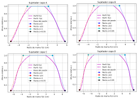
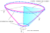
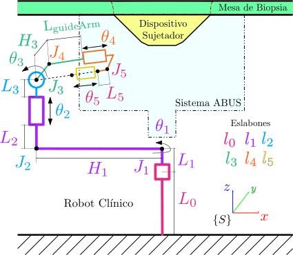
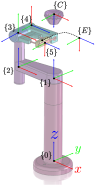
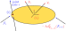
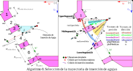
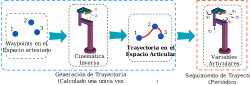

.pull-leftNN[
## .orange[Diseño de requerimientos]
### Del flujo de trabajo para biopsia percutánea de mama
```{r tablaVentajasDesventajas, echo=FALSE, out.width = '100%'}

```
]

.pull-right[.center[
```{r flowchartBiopsia, echo=FALSE, out.width = '59%'}
knitr::include_graphics("image/flowCharts/flujoDeTrabajoBiopsia.svg")
```
]]

---
<div class="my-footer"><span>&emsp;&emsp;&emsp;&emsp;&emsp;&emsp; Modelamiento y simulación de un robot clínico asistido por Ultrasonido 3D para mejorar el guiado de inserción de agujas en biopsia percutánea de mama</span></div> 

.pull-leftNN[
## .orange[Diseño de requerimientos]
### De la mama
.middlePos[
```{r caracterizacionMama, echo=FALSE, out.width = '100%'}

```
]
]

.pull-right[
### Del robot clínico
.middlePos[
```{r echo=FALSE}
text_tbl <- data.frame( "Requerimientos" = c("Exactitud y Precisión","Fuente de Alimentación","Rigidez","Seguridad","Esterilización"), "Características" = c("Posición previa del robot. Error promedio 0.54-3.21 mm.",
"Fuentes eléctrónicas y eléctricas.","De apariencia liviana y movimiento suave.","No interferir con el espacio de trabajo de otros elementos. Mecanismo de parada de emergencia.","De fácil limpieza supercial y uso hospitalario."))
kbl(text_tbl, booktabs = T) %>%
kable_styling(full_width = F) %>%
column_spec(1, bold = T, color = "blue") %>%
column_spec(2, width = "16em")
```
]]

---
```{r include=FALSE}
megali2001 = Citep(biblio,"Megali2001",.opts = list(longnamesfirst = FALSE, max.names=2))
cap_caracterizacionMama = paste0("Componentes del sistema robótico Dexter. (a) Robot llevando el (b) Efector final para
guía de agujas adaptado con sensores de movimiento. (c) Transductor de US sensorizado ",megali2001)
```

## .orange[Diseño de requerimientos]
### Del efector final
```{r efectorFinalDexter, echo=FALSE, fig.cap=cap_caracterizacionMama,out.width = '100%'}
knitr::include_graphics("image/efectorFinalDexter.svg")
```

---
## .orange[Diseño de requerimientos]
### De la biopsia
```{r echo=FALSE}
text_tbl <- data.frame( "N°" = 1:9, "Características" = c(
"Trayectoria ideal fue una línea recta.",
"Desplazamiento del objetivo de biopsia fue mínima (nulo) ",
"Espacio de tarea (task space) no realista. Aproximado a un volumen cónico truncado a partir de dimensiones anatómicas.",
"Volumen cónico caracterizado en cuatro tamaños promedio o copa (A,B,C y D). ",
"Un objetivo de biopsia se define como el centroide de una posible anamolía o elegido por criterio médico (ausente). Posicón en el espacio cartersiano.",
"Localización y visualización mediante un Sistema Automatizado de Ultrasonido de Mama (ABUS). Rotación total y radial de 360°",
"Uso de un Dispositivo Sujetador para:  Estabilización e inmovilización. Y soporte estructural de la mama.",
"Inserción de tipo oblícua. Confianza en la correcta localización del objetivo por el sistema ABUS.",
"Uso de dispositivos de biopsia básicos: Aguja fina para aspiración (FNA) y aguja gruesa (CN)"))
kbl(text_tbl, booktabs = T) %>%
kable_styling(full_width = F) %>%
column_spec(1, bold = T, color = "blue") %>%
column_spec(2, width = "45em")
```

---
.pull-left[
## .greenC[Procedimiento]
### Para el flujo de trabajo: .black[.footnotesize[Espacio de trabajo del Robot]]
```{r include=FALSE}
Huang2011 = Citet(biblio,"Huang2011",.opts = list(longnamesfirst = FALSE, max.names=1))
cap_perfilesMama = paste0("Basado en los datos de ",Huang2011)
```

```{r perfilesMama, echo=FALSE, fig.cap=cap_perfilesMama,out.width = '100%', fig.align='center'}
knitr::include_graphics("image/perfilesMama.svg")
```
]

.pull-rightNN[
```{r perfilesHolder, echo=FALSE,out.width = '100%'}

```

```{r dimensionesModelamientoConico, echo=FALSE,out.width = '100%'}
knitr::include_graphics("tablas/tab_dimensionesPrincipalesModelamientoConico.svg")
```
$$z = {H_\text{holder}} - \frac{{{H_\text{holder}}(r - {R_\text{lower}})}}{{{R_\text{upper}} - {R_\text{lower}}}}$$
]

---
.pull-left[
## .greenC[Procedimiento]
### Para el flujo de trabajo: .black[.footnotesize[Dispositivo sujetador de mama]]
.full-width[.content-box-blue[
1. De **Capa intermedia** entre mama y transductor de US (.black[Etapa de diag. por imagen]).
2. Para acceso a la mama manteniendo **fijo y estable** el tejido (.black[Etapa de biopsia]).
]]
.full-width[.content-box-red[
Tres partes básicas:
.center[
* Soporte estructural
* Tapas desplegables
* Varillas de giro]
]]
]
.pull-right[
```{r conceptoHolder, echo=FALSE,fig.cap = "Estructura cónica", out.width = '80%', fig.align='center'}

```
```{r conceptoCanastilla, echo=FALSE,fig.cap = "Concepto de sujetador",out.width = '60%', fig.align='center'}

```
.full-width[.content-box-yellow[.large[Fenómeno de Acople Acústico requerido]]]
]

---
.pull-left[
## .greenC[Procedimiento]
### Para modelamiento del robot clínico: .black[La cadena cinemática]

```{r echo=FALSE}
tab_robot = data.frame(
  Joint = c("J_1", "J_2", "J_3", "J_4", "J_5"),
  tipo1 = c("Revoluta", "Prismático", "Revoluta","Prismático", "Prismático"),
  tipo2 = c("Activo", "Activo", "Activo", "Activo", "Pasivo")
)

kbl(
  tab_robot,
  booktabs = TRUE,
  col.names = c("Joint", "Tipo de\n movimiento", "Tipo de \n fuente"),
  align = c("c", "c", "c"),
)
```
]

.pull-rightN[.middlePos[
```{r esquemaCadenaCinematica, echo=FALSE,fig.cap = "Esquema del robot clínico",out.width = '95%', fig.align='center'}

```
]]
---
.pull-left[
## .greenC[Procedimiento]
### Para modelamiento del robot clínico: .black[Cáculo de dimensiones]
Utilizando el **Algoritmo 6: Modelo geométrico de robot clínico**.

```{r procedimientoAlgoritmoCalculoDim, echo=FALSE,fig.cap = "Esquema para cálculo de dimensiones", out.width = '70%', fig.align='center'}
knitr::include_graphics("image/flujoDimensionRobot.svg")
```
]

.pull-rightN[.middlePos[
```{r esquemaEsquemaDimensiones, echo=FALSE,fig.cap = "Esquema para cálculo de dimensiones", out.width = '95%', fig.align='center'}
knitr::include_graphics("image/esquemaRobot2.svg")
```
]]
---
.pull-leftNN[
## .greenC[Procedimiento]
### Para modelamiento del robot clínico: .black[Cinemática Directa]
```{r include=FALSE}
Lynch2017 = Citet(biblio,"Lynch2017",.opts = list(longnamesfirst = FALSE, max.names=2))
Park1995 = Citet(biblio,"Park1995",.opts = list(longnamesfirst = FALSE, max.names=1))
```

$$\begin{equation}
	{S_1} = \left[ {\begin{array}{*{20}{c}}
			0\\
			0\\
			1\\
			0\\
			0\\
			0
	\end{array}} \right]{\rm{  }}{S_2} = \left[ {\begin{array}{*{20}{c}}
			0\\
			0\\
			0\\
			0\\
			0\\
			1
	\end{array}} \right]{\rm{  }}{S_3} = \left[ {\begin{array}{*{20}{c}}
			0\\
			{ - 1}\\
			0\\
			{L_* + {H_2}}\\
			0\\
			{{H_1}}
	\end{array}} \right]{\rm{  }}{S_4} = \left[ {\begin{array}{*{20}{c}}
			0\\
			0\\
			0\\
			0\\
			0\\
			1
	\end{array}} \right]{\rm{  }}{S_5} = \left[ {\begin{array}{*{20}{c}}
			0\\
			0\\
			0\\
			0\\
			0\\
			1
	\end{array}} \right]
\end{equation}$$
$$\begin{equation}
	\begin{array}{c}
		{M_1} =\left[ {\begin{array}{*{20}{c}}
				1&0&0&0\\
				0&1&0&0\\
				0&0&1&{{L_0} + {L_1}}\\
				0&0&0&1
		\end{array}} \right]
		{M_2} = \left[ {\begin{array}{*{20}{c}}
				1&0&0&{ - {H_1}}\\
				0&1&0&0\\
				0&0&1&{{L_0} + {L_1}}\\
				0&0&0&1
		\end{array}} \right]\\
		{M_3} = \left[ {\begin{array}{*{20}{c}}
				1&0&0&{ - {H_1}}\\
				0&{ - 1}&0&0\\
				0&0&1&{L_*}\\
				0&0&0&1
		\end{array}} \right]
	\end{array}
\end{equation}$$

]

.pull-right[
$$\begin{equation}
	\begin{array}{c}
		{M_4} = \left[ {\begin{array}{*{20}{c}}
				0&0&1&{ - {H_1}}\\
				0&{ - 1}&0&{{H_3}}\\
				1&0&0&{L_* + {L_3}}\\
				0&0&0&1
		\end{array}} \right]\\
		{M_5} = {M_{st}} = \left[ {\begin{array}{*{20}{c}}
				0&0&1&{{L_3} - {H_1}}\\
				{ - 1}&0&0&0\\
				0&{ - 1}&0&{L_* + {H_2}}\\
				0&0&0&1
		\end{array}} \right]\\
		{M_6} = {M_{se}} = \left[ {\begin{array}{*{20}{c}}
				0&0&0&{{L_3} - {H_1} - {L_5}}\\
				{ - 1}&0&0&0\\
				0&{ - 1}&1&{L_* + {H_2}}\\
				0&0&0&1
		\end{array}} \right]
	\end{array}
\end{equation}$$

Donde, $$L_* = L_0 + L_1 + L_2$$

Basado en la **Fórmula del Producto de Exponenciales** descrita por `r Park1995` y `r Lynch2017`:

$$\begin{equation}\label{eq:formulaPOE_spatial}
			T = {e^{[{S_1}]{\theta _1}}}...{\text{ }}{e^{[{S_{n - 1}}]{\theta _{n - 1}}}}{e^{[{S_n}]{\theta _n}}}M
		\end{equation}$$
]

---
.pull-leftN2[
## .greenC[Procedimiento]
### Para modelamiento del robot clínico: .black[Cinemática Directa]

$$\begin{equation}
	\begin{array}{l}
		T_{st} = \left(\begin{array}{cccc}
			\mathrm{sin}\left(\theta_1 \right) & \mathrm{cos}\left(\theta_1 \right)\,\mathrm{sin}\left(\theta_3 \right) & \mathrm{cos}\left(\theta_1 \right)\,\mathrm{cos}\left(\theta_3 \right) & \mathrm{cos}\left(\theta_1 \right)\,\sigma_1 \\
			-\mathrm{cos}\left(\theta_1 \right) & \mathrm{sin}\left(\theta_1 \right)\,\mathrm{sin}\left(\theta_3 \right) & \mathrm{cos}\left(\theta_3 \right)\,\mathrm{sin}\left(\theta_1 \right) & \mathrm{sin}\left(\theta_1 \right)\,\sigma_1 \\
			0 & -\mathrm{cos}\left(\theta_3 \right) & \mathrm{sin}\left(\theta_3 \right) & \sigma_2 + L_3\,\mathrm{sin}\left(\theta_3 \right)+\theta_4 \,\mathrm{sin}\left(\theta_3 \right)+\theta_5 \,\mathrm{sin}\left(\theta_3 \right)\\
			0 & 0 & 0 & 1
		\end{array}\right)
	\end{array}
\end{equation}$$

$$\begin{equation}
	{T_{sc}} = \left[ {\begin{array}{*{20}{c}}
			1&0&0&0\\
			0&{ - 1}&0&0\\
			0&0&{ - 1}&{{H_\text{table}}}\\
			0&0&0&1
	\end{array}} \right]
\end{equation}$$
]

.pull-rightN2[
```{r esquemaCinematicaInversa, echo=FALSE,fig.cap = "Sistemas de referencias (frames)", out.width = '75%', fig.align='right'}

```
]

---
.pull-leftN[
## .greenC[Procedimiento]
### Para modelamiento del robot clínico: .black[Cinemática Inversa]
Utilizando el **Algoritmo 7. Modelo de Cinemática Inversa**:
$$\begin{align}
				\begin{array}{*{20}{c}}{\left[ {\begin{array}{*{20}{c}}{{h_s}}\\1\end{array}} \right] = {T_{sc}}\left[ {\begin{array}{*{20}{c}}{{h_c}}\\1\end{array}} \right]{\text{,  }}{{\hat n}_s} = {R_{sc}}{{\hat n}_c}}\\{\left[ {\begin{array}{*{20}{c}}{{c_s}}\\1\end{array}} \right] = {T_{sc}}\left[ {\begin{array}{*{20}{c}}c\\1\end{array}} \right]}\end{array}
\end{align}$$

<hr class="divider">
$$\begin{align}
        {q_1} &= atan2({h_{sy}},{h_{sx}}{\rm{)}}\\
				&{\theta_1} = {q_1} + \pi \\
				&{\theta_1} = {q_1} - \pi \\
			{\theta_4} &= \frac{{{r_{14}} + {H_1} - {L_3}\cos ({\theta_3})}}{{\cos ({\theta_3})}}\\
			{\theta _3} &= atan2({r_{33}},{r_{13}})\\
			{\theta_2} &= {r_{34}} - {L_2} - {H_2} - \sin(\theta_3) ({L_3} + {q_4})
\end{align}$$

]
.pull-rightN[
```{r equemaFramesRobot, echo=FALSE,fig.cap = "Esquema de cálculo", out.width = '100%', fig.align='center'}
knitr::include_graphics("image/cinematicaInversa.svg")
```
]
---
.pull-leftN[
## .greenC[Procedimiento]
### Para modelamiento del robot clínico: .black[Dinámica Inversa]
```{r include=FALSE}
labelDinamicaInversa = paste0("Diagrama de cuerpo libre. ","Adaptado de ",Lynch2017)
```

```{r eval=FALSE}
Algoritmo 4: Método Newton-Euler
1. Inicialización
2. Iteración hacia adelante (Forward step) #<<
{{3. Iteración hacia atras (Backward step)}}
```

```{r esquemaDinamicaInversa, echo=FALSE,fig.cap = labelDinamicaInversa, out.width = '100%', fig.align='center'}

```
]

.pull-rightNN[
Para .black[paso 1],
* $M_{l_{i},l_{i-1}}$ : Configuración $\{l_{i-1}\}$ en $\{l_{i}\}$ cuando $\theta_i = 0$.
* $\mathcal{A}_i$ : Screw axis en $\{l_{i}\}$. ${A_i} = A{d_{M_{l_i}^{ - 1}}}({S_i})$
* $\mathcal{G}_i$ : Matriz de inercia espacial. ${\mathcal{G}_b} = \left[ {\begin{array}{*{20}{c}}{{I_b}}&0 \\ 0&{\mathfrak{m}I} \end{array}} \right]$
* Dado $V_0 = 0$. Tamaño $1\times6$.
* Dado $\dot V_{0}=({\dot{\omega}},{\dot{v}_0})=(0,-\mathfrak{g})$. Tamaño $1\times6$.
* Dado $F_{n+1}=F_\text{tip}=({m_\text{tip}},{f_\text{tip}})$. Tamaño $1\times6$.


Para .black[paso 2], dado $\theta, \dot \theta$ y $\ddot{\theta}$ para $i=1$ a $n$:
$$\begin{align}
			{T_{l_{i}, l_{i-1}}} &= {e^{ - [{A_i}]{\theta _i}}}{M_{l_{i}, l_{i-1}}} \hfill \\
			{V_i} &= A{d_{{T_{l_{i}, l_{i-1}}}}}({V_{i - 1}}) + {A_i}{{\dot \theta }_i} \hfill \\
			{{\dot V}_i} &= A{d_{{T_{l_{i}, l_{i-1}}}}}({{\dot V}_{i - 1}}) + a{d_{{V_i}}}({A_i}){{\dot \theta }_i} + {A_i}{{\ddot \theta }_i} \hfill 
		\end{align}$$

Para .black[paso 3], de $i=n-1$ hacia $1$:
$$\begin{align}
{F_i} &= Ad_{{T_{l_{i+1}, l_{i}}}}^T({F_{i + 1}}) + {G_i}{{\dot V}_i} - ad_{{V_i}}^T({G_i}{V_i}) \\
{\tau _i} &= F_i^T{A_i} \\
{\tau}  &= {{\left[ {{{\begin{array}{*{20}{c}}{{F_i}}\\m\end{array}}_i}} \right]}^T} {\left[ {\begin{array}{*{20}{c}}{{v_i}} \\ {{\omega _i}} \end{array}} \right]} = {F_i}{v_i} + {m_i}{\omega _i} \\
&= {\text{Potencia lineal + Potencia rotacional (par motor)}}
\end{align}$$
]
---
.pull-leftN[
## .greenC[Procedimiento]
### Para modelamiento del robot clínico: .black[Dinámica Directa]
Dado $\theta, \dot{\theta}, \tau$ y un wrench $F_\text{tip}$ en el efector final:
$$\begin{align}
  \tau  &= M(\theta )\ddot \theta  + c(\theta ,\dot \theta ) + N(\theta ) + {J^T}(\theta ){F_\text{tip}}\\
  \tau  &= M(\theta )\ddot \theta  + h(\theta ,\dot \theta ) + {J^T}(\theta ){F_\text{tip}}\\
  & \text{Por lo tanto, para } \ddot{\theta} :\\ 
  M(\theta )\ddot \theta  &= \tau  - h(\theta ,\dot \theta ) - {J^T}(\theta ){F_\text{tip}}\\
  \ddot \theta  & = {M(\theta )^{ - 1}}\left( {\tau  - h(\theta ,\dot \theta ) - {J^T}(\theta ){F_\text{tip}}} \right)
\end{align}$$
]
.pull-rightNN[
```{r include=FALSE}
Murray1994 = Citet(biblio,"Murray1994",.opts = list(longnamesfirst = FALSE, max.names=1))
Johan2014 = Citet(biblio,"Johan2014",.opts = list(longnamesfirst = FALSE, max.names=1))
Featherstone2009= Citet(biblio,"Featherstone2009",.opts = list(longnamesfirst = FALSE, max.names=1))
Rao2006 = Citet(biblio,"Rao2006",.opts = list(longnamesfirst = FALSE, max.names=1))
```

.middlePos[

```{r echo=FALSE}
variable = c(rep("M",3),rep("C",3),rep("N",3),rep("h",1),rep("J*F",2))
text_tbl <- data.frame( "Elemento" = variable, "Algoritmo" = c(
paste0("Basado en el Algoritmo Newton-Euler de ",Lynch2017),
paste0("Uso de Body Jacobian en link frames según ",Johan2014," y ",Murray1994),
paste0("modelo de Cuerpos Rígidos Compuestos de ",Featherstone2009),
"Por derivadas parciales.",
"Basado en el Algoritmo Newton-Euler",
"Modelo basado en los símbolos de Christofell y teoría Lie Bracket",
"Basado en el Algoritmo Newton-Euler",
"Por derivadas parciales",
paste0("Fomulación fuerzas gravitacionales de ",Rao2006),
"Basado en el Algoritmo Newton-Euler",
"Usando Body Jacobian",
"Basado en el Algoritmo Newton-Euler"
))
kbl(text_tbl, booktabs = T,align = "c") %>%
column_spec(1, bold = T, color = "blue") %>%
collapse_rows(1, latex_hline = "major", valign = "middle")
```
]
]

---
.pull-left[
## .greenC[Procedimiento]
### Para la generación de trayectorias. .blue[Planificación de ruta del Efector final(EE)] .black[Riesgo por colisiones]
```{r riesgoPorColision, echo=FALSE,fig.cap = "", out.width = '100%', fig.align='center'}
knitr::include_graphics("image/riesgoPorColisiones.svg")
```
> .red[Alcanzabilidad]

$$\begin{equation}
		\begin{array}{*{20}{c}}
			\text{Si }{\forall {\theta _i} < \theta_{i\max },}&{{\text{el objetivo es alcanzable}}} \\ 
			\text{Sino }{\exists {\theta _i} > \theta_{i\max },}&{{\text{el objetivo es inalcanzable}}} 
		\end{array}
	\end{equation}$$
]

.pull-rightN[
> .red[Colisiones por inserción]
  * Tipo 1: Con los soportes horizontales del dispositivo sujetador de mama.
  * Tipo 2: Con los soportes verticales.
  * Tipo 3: *Con una tapa vecina.*
  * Tipo 4: Con la pared torácica de la paciente.

```{r tiposColision, echo=FALSE,fig.cap = "", out.width = '100%', fig.align='right'}
knitr::include_graphics("image/colision124.svg")
```
]
---
## .greenC[Procedimiento]
### Para la generación de trayectorias: .black[Riesgo por colisiones]
```{r algoritmoInsercion, echo=FALSE,fig.cap = "", out.width = '80%', fig.align='center'}

```

---
## .greenC[Procedimiento]
### Para la generación de trayectorias: .black[Casos de Inserción]
```{r casosInsercion123, echo=FALSE,fig.cap = "", out.width = '100%', fig.align='center'}
knitr::include_graphics("image/casosInserción.svg")
```

---
## .greenC[Procedimiento]
### Para la generación de trayectorias: .black[Casos de Inserción]
```{r casosInsercion4y5, echo=FALSE,fig.cap = "", out.width = '83%', fig.align='center'}
knitr::include_graphics("image/casosInserción4y5.svg")
```

---
## .greenC[Procedimiento]
### Para la generación de trayectorias: .black[Cálculo de desplazamiento del Efector Final]
```{r desplazamientoEE, echo=FALSE,fig.cap = "", out.width = '85%', fig.align='center'}
knitr::include_graphics("image/diagramaCalculoDistancias.svg")
```

$$\begin{align}
	\text{Retiro mínimo del EE} &= \begin{cases}
		\text{Longitud de aguja FNA} - \left( \left\| {t{p_s}} \right\| + \text{Offset}_{\text{needle}} \right)\\
		\text{Longitud de aguja CN} - \left( \left\| {t{p_s}} \right\| + \text{Offset}_{\text{needle}} \right) + \frac{\text{throw}}{2} - \text{dead space}
	\end{cases}\\
	{\text{Retiro máximo del EE}} &= {\theta _4}{\text{ + Offse}}{{\text{t}}_{L5}}{\text{ - }}\left( {{\text{Offset}}{{\text{t}}_{{\text{needle}}}} + {\text{Longitud de aguja}}} \right)
\end{align}$$
---
## .greenC[Procedimiento]
### Para la generación de trayectorias: .blue[Planificación de trayectorias del Efector Final]
```{r include=FALSE}
Siciliano2009 = Citet(biblio,"Siciliano2009",.opts = list(longnamesfirst = FALSE, max.names=1))
labelGeneracionTrayectoria = paste0("Basado en ",Siciliano2009)
```

.left-column[
```{r generacionTrayectorias, echo=FALSE,fig.cap = labelGeneracionTrayectoria,out.width = '100%', fig.align='center'}
knitr::include_graphics("image/trajectoryPlanning.svg")
```
]

.right-column[
```{r solucionGeneracionTrayectorias, echo=FALSE,fig.cap = "", out.width = '100%', fig.align='center'}

```
]
