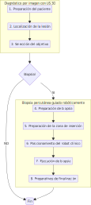
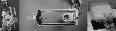
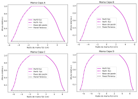
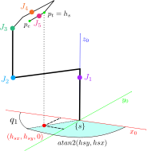
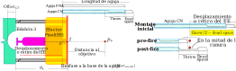

.pull-leftN2[
# .orange[Diseño de requerimientos]
## .purple[Del flujo de trabajo cínico para biopsia percutánea de mama]
```{r tablaVentajasDesventajas, echo=FALSE, out.width = '100%'}
knitr::include_graphics("tablas/tab_principalesVentajasDesvetajasBiopsiaGuiadaPorImagen.svg")
```
]

--
.pull-rightN2[
```{r flowchartBiopsia, echo=FALSE, out.width = '70%',fig.align='right'}

```
]


???
Así llegamos a la sección de materiales y métodos. Ordenada en dos etapas: La etapa de diseño de requerimientos y la de procedimiento.

Para el diseño de requer. Dado que no existe un antecedente a nivel nacional para biopsias guiadas robóticamente, es que se propuso un nuevo flujo de trabajo clínico: Conjunto de procedimientos y responsabilidades del personal médico para obtener un resultado exitoso a nivel hospitalario. Según el MINSA, esta propuesta estaría orientada al área de Diagnóstico por Imagen. 

Pero primero, se mustra la comparación realizada entre las principales sistemas de guiado para biopsia: 

Por su parte, en mamagrafía ...

Todas estas características, permitieron proponer el siguiente flujo de trabajo a realizar durante una consulta externa para evaluación y diagnóstico de cáncer de mama.

La idea del fujo de trabajo, es permitir un proceso secuencial de dos etapas generalmente realizadas en tiempo y lugar distintos. En este caso, ambas etapas deberían ser funcionalmente compatibles. 

---
<div class="my-footer"><span>&emsp;&emsp;&emsp;&emsp;&emsp;&emsp; Modelamiento y simulación de un robot clínico asistido por Ultrasonido 3D para mejorar el guiado de inserción de agujas en biopsia percutánea de mama</span></div> 

# .orange[Diseño de requerimientos]
.pull-leftNN[
## .purple3[De la mama]
```{r caracterizacionMama, echo=FALSE, out.width = '100%'}
knitr::include_graphics("tablas/tab_caracterizacionMedidasAnatomicas.svg")
```
]
???
Como el objetivo final es mejorar el diagnóstico de cáncer de mama, es indispensable el estudio del organo mamario. Para ello, su modelamiento debe basarse en al menos medidas anatómicas reales que caracterizen un modelo más realista. Así utilizando los resultados de Huang2011 mediante mamografía se obtuvo una clasificación de mujeres en 4 tamaños o copa mamaria.

Se resalta, que el volumen mamamrio aumenta a mayor copa mamaria. De igual modo, para su diametro y altura.

--
.pull-rightNN[
## .blueC[Del robot clínico]
```{r echo=FALSE}
text_tbl <- data.frame( "Requerimientos" = c("Exactitud y Precisión","Fuente de Alimentación","Rigidez","Seguridad","Esterilización"), "Características" = c("Posición previa del robot. Error promedio 0.54-3.21 mm.",
"Fuentes eléctrónicas y eléctricas.","De apariencia liviana y movimiento suave.","No interferir con el espacio de trabajo de otros elementos. Mecanismo de parada de emergencia.","De fácil limpieza supercial y uso hospitalario."))
kbl(text_tbl, booktabs = T) %>%
kable_styling(full_width = F) %>%
column_spec(1, bold = T, color = "#1e72fd") %>%
column_spec(2, width = "25em")
```
]

???
Acerca del robot clínico, se tiene que los requerimientos mínimos son diversos. Por ejemplo:
* Exacti.... El estado de arte de robot para biopsias percutáneas en experimentos tienen errores de posición promedio desde 0.54...
* Fuente ..: El uso US, no exige alguna restricción .... Lo que si ocurre con resonancia magnética. 

* Esterilizac...: La superficie y material del robot deben permitir su facil desinfección.


---
```{r include=FALSE}
megali2001 = Citep(biblio,"Megali2001",.opts = list(longnamesfirst = FALSE, max.names=1))
cap_caracterizacionMama = paste0("Componentes del sistema robótico Dexter. (a) Robot llevando el (b) Efector final para
guía de agujas adaptado con sensores de movimiento. (c) Transductor de US sensorizado ",megali2001)
```

# .orange[Diseño de requerimientos]
## .greenC2[Del efector final]
```{r efectorFinalDexter, echo=FALSE, fig.cap=cap_caracterizacionMama,out.width = '95%'}

```

???
Acerca del efector final, que es la parte encargada de manipular las herramientas e instrumentos se inspiró en:

Sistema de riel para un movimiento rectilineo donde se monta el dispositivo de biopsia que al desplazarse, su aguja pasa mediante un agujero sensoriado para medir milimetricamente su avance. 

---
# .orange[Diseño de requerimientos]
## .purple2[De la biopsia]
```{r echo=FALSE}
text_tbl <- data.frame( "N°" = 1:9, "Características" = c(
"Trayectoria ideal fue una línea recta.",
"Desplazamiento del objetivo de biopsia fue mínima (nulo) ",
"Espacio de tarea (task space) no realista. Aproximado a un volumen cónico truncado a partir de dimensiones anatómicas.",
"Volumen cónico caracterizado en cuatro tamaños promedio o copa (A,B,C y D). ",
"Un objetivo de biopsia se define como el centroide de una posible anamolía o elegido por criterio médico (ausente). Posición en el espacio cartersiano.",
"Localización y visualización mediante un Sistema Automatizado de Ultrasonido de Mama (ABUS). Rotación total y radial de 360°",
"Uso de un Dispositivo Sujetador para:  Estabilización e inmovilización. Y soporte estructural de la mama.",
"Inserción de tipo oblícua. Confianza en la correcta localización del objetivo por el sistema ABUS.",
"Uso de dispositivos de biopsia básicos: Aguja fina para aspiración (FNA) y aguja gruesa (CN)"))
kbl(text_tbl, booktabs = T) %>%
kable_styling(full_width = F) %>%
column_spec(1, bold = T, color = "#8a0bd2") %>%
column_spec(2, width = "45em")
```

???
Acerca de la biopsia misma, se asumió diferentes características para poder ser modelado y finalmente simulado:

1. ::  
2. :: Debido a que se asumió un comportamiento rígido de las agujas, en vez de flexibles.
3. :: Ya que no se trabajó con un modelo anatómico realista de la mama, sino a partir de dimensiones promedio que llevaron aproximar su forma y volumen a una figura cónica truncada.
4. Con base a lo anterior, se obtuvo 4 modelos por tamaño 
5. Cuando se habla de un objetivo de biopsia, .... Por tanto, utilizar posiciones...
6. Se requiere la inclusión de algún sitema ...  denominado ABUS para localizar y visualizar imagenes de US 3D a partir de una rotacion ...
7. .... Con función de estabilizar.  Pero tambien para servir como soporte estructural o superficie durante la etapa de escaneo con US. 
8. El tipo de inserción será... A pesar de que las guias clínicas recomienden una inserción horizontal, paralela al abdominal, debido a la confianza ...
9. Para modelor y simular el movimiento agujas, se utilizaron disposit. básiscos de biopsia:  ... abreviado como FNA en ingles, 

---
.pull-left[
# .greenC[Procedimiento]
## .purple[Para el flujo de trabajo:] .black[.footnotesize[Espacio de trabajo del Robot]]
```{r include=FALSE}
Huang2011 = Citet(biblio,"Huang2011",.opts = list(longnamesfirst = FALSE, max.names=1))
cap_perfilesMama = paste0("Basado en los datos de ",Huang2011)
```

```{r perfilesMama, echo=FALSE, fig.cap=cap_perfilesMama,out.width = '100%', fig.align='center'}

```
]

--
.pull-rightNN[
```{r perfilesHolder, echo=FALSE,out.width = '100%'}
knitr::include_graphics("image/perfilesHolder.svg")
```

```{r dimensionesModelamientoConico, echo=FALSE,out.width = '100%'}

```
$$z = {H_\text{holder}} - \frac{{{H_\text{holder}}(r - {R_\text{lower}})}}{{{R_\text{upper}} - {R_\text{lower}}}}$$
]

???
Utilizando los datos anatómicos y funciones polinómicas de Huang2011 fue posible reconstruir los distintos perfiles mamarios por tamaño de copa. Para luego, mediante el Algoritmo 5 (Manteniendo la numeración de algoritmos en el informe de tesis) se obtuvo rectas que circunden dichos perfiles para finalmente, obtener las radios y altura para un modelamiento cónico truncado del disposit. sujetador.

Y también, encontrar una función de las variables radio cónico r y su altura mediante:

---
.pull-leftNN[
# .greenC[Procedimiento]
## .purple[Para el flujo de trabajo:] .black[.footnotesize[Dispositivo sujetador de mama]]
.full-width[.content-box-blue[
1. De **Capa intermedia** entre mama y transductor de US (.black[Etapa de diag. por imagen]).
2. Para acceso a la mama manteniendo **fijo y estable** el tejido (.black[Etapa de biopsia]).
]]
.full-width[.content-box-red[
Con tres partes básicas:
* Soporte estructural hueco
* Tapas desplegables
* Punto de giro para tapas]
]
]

--
.pull-rightNN[
```{r conceptoHolder, echo=FALSE,fig.cap = "Estructura cónica", out.width = '80%', fig.align='center'}
knitr::include_graphics("image/holderConcept.svg")
```
```{r conceptoCanastilla, echo=FALSE,fig.cap = "Concepto de sujetador",out.width = '60%', fig.align='center'}
knitr::include_graphics("image/baseCanastilla.png")
```
.full-width[.content-box-yellow[.large[.center[Fenómeno de Acople Acústico requerido]]]]
]
???
Para este sujetador si bien toma como punto de partida las dimensiones anteriores, son las funciones que de debe cumplir durante las etapas de diagnóstio por imagen y biopsia las que determinaron su forma y detalles:

Así se buscó obtener algún mecanismo con las siguientes partes básicas:

---
.pull-left[
# .greenC[Procedimiento]
## .orange2[Para modelamiento del robot:] .black[.footnotesize[Cadena cinemática]]

```{r echo=FALSE}
tab_robot = data.frame(
  Joint = c("J_1", "J_2", "J_3", "J_4", "J_5"),
  tipo1 = c("Revoluta", "Prismático", "Revoluta","Prismático", "Prismático"),
  tipo2 = c("Activo", "Activo", "Activo", "Activo", "Pasivo")
)

kbl(
  tab_robot,
  booktabs = TRUE,
  col.names = c("Joint", "Tipo de\n movimiento", "Tipo de \n fuente"),
  align = c("c", "c", "c"),
)
```
]

--
.pull-rightN[.middlePos[
```{r esquemaCadenaCinematica, echo=FALSE,fig.cap = "Cadena cinemática RPRPP",out.width = '100%', fig.align='center'}
knitr::include_graphics("image/esquemaRobot1.svg")
```
]]
???
De aquí el que más destaca es la ultima articulación o joint que es de tipo prismático y pasivo. Es decir, permite un movimento lineal del efector final pasivo o no motorizado, ideal para el control total del médico durante la inserción.

Se presenta la cadena cinemática del robot en conjunto con otros elementos de trabajo como el disp. sujetador y la mesa de biopsia.

*El primer joint permite una rotación simétrica y total del robot por debajo del dispositivo sujetador.
*El segundo joint eleva el resto del robot hacia una altura de la mesa.
*El tercer joint permitar rotar el efector final y orientarse en la dirección de inserción.
*EL cuarto joint acercar el robot lo más seguro posible, frente al dispositivo sujetador. 
*Para finalmente, dejar el movimiento del efector final en el joint 5 de tipo pasivo.

---
.pull-left[
# .greenC[Procedimiento]
## .orange2[Para modelamiento del robot:] .black[.footnotesize[Dimensiones]]
Utilizando el **Algoritmo 6: Modelo geométrico de robot clínico**.

```{r procedimientoAlgoritmoCalculoDim, echo=FALSE,fig.cap = "Esquema para cálculo de dimensiones", out.width = '70%', fig.align='center'}

```
]

--
.pull-rightN[.middlePos[
```{r esquemaEsquemaDimensiones, echo=FALSE,fig.cap = "Esquema para cálculo de dimensiones", out.width = '100%', fig.align='center'}
knitr::include_graphics("image/esquemaRobot2.svg")
```
]]

???
Para hallar las dimensiones de la cadena cinemática se utilizó el algoritmo 6. Este se basó primero, en hallar un modelo geométrico particular del robot para cada tamaño de dispositivo sujetador. Para luego, obtener un único modelo general que englobe lo anterior. 

Así utilizando este esquema, se representó dos posible casos extremos de movimiento manteniendo el criterio de la ruta de inserción más corta (dirección de inserción es perpendicular a la superficie del sujetador.)

Así, se tiene un caso extremo inferior en el radio menor del sujetador....
Y un caso extremo superior, en el radio mayor, con una distancia ...

Del mismo análisis, se puede encontrar una altura maxima dado por el joint 2 y el avance máximo del joint 4 para acercarse al sujetador. 

También se buscaron dimensiones documentadas del equipo de ultrasonido, como este transductor y posible altura de la mesa de biopsia.

El mismo esquema, ofrece un panorama de lo que supondría ser el fundamento de un sistema ABUS, que permita escaneos de imagen en forma total, alrededor de la mama, y radial, manteniendo esta inclinación.

---
.pull-leftNN[
# .greenC[Procedimiento]
## .orange2[Para modelamiento del robot:] .black[.footnotesize[Cinemática Directa]]
```{r include=FALSE}
Lynch2017 = Citet(biblio,"Lynch2017",.opts = list(longnamesfirst = FALSE, max.names=2))
Park1995 = Citet(biblio,"Park1995",.opts = list(longnamesfirst = FALSE, max.names=1))
```

$$\begin{equation}
	{S_1} = \left[ {\begin{array}{*{20}{c}}
			0\\
			0\\
			1\\
			0\\
			0\\
			0
	\end{array}} \right]{\rm{  }}{S_2} = \left[ {\begin{array}{*{20}{c}}
			0\\
			0\\
			0\\
			0\\
			0\\
			1
	\end{array}} \right]{\rm{  }}{S_3} = \left[ {\begin{array}{*{20}{c}}
			0\\
			{ - 1}\\
			0\\
			{L_* + {H_2}}\\
			0\\
			{{H_1}}
	\end{array}} \right]{\rm{  }}{S_4} = \left[ {\begin{array}{*{20}{c}}
			0\\
			0\\
			0\\
			0\\
			0\\
			1
	\end{array}} \right]{\rm{  }}{S_5} = \left[ {\begin{array}{*{20}{c}}
			0\\
			0\\
			0\\
			0\\
			0\\
			1
	\end{array}} \right]
\end{equation}$$
$$\begin{equation}
	\begin{array}{c}
		{M_1} =\left[ {\begin{array}{*{20}{c}}
				1&0&0&0\\
				0&1&0&0\\
				0&0&1&{{L_0} + {L_1}}\\
				0&0&0&1
		\end{array}} \right]
		{M_2} = \left[ {\begin{array}{*{20}{c}}
				1&0&0&{ - {H_1}}\\
				0&1&0&0\\
				0&0&1&{{L_0} + {L_1}}\\
				0&0&0&1
		\end{array}} \right]
	\end{array}
\end{equation}$$

]

.pull-right[
$$\begin{equation}
	\begin{array}{c}
	  {M_3} = \left[ {\begin{array}{*{20}{c}}
				1&0&0&{ - {H_1}}\\
				0&{ - 1}&0&0\\
				0&0&1&{L_*}\\
				0&0&0&1
		\end{array}} \right]
		{M_4} = \left[ {\begin{array}{*{20}{c}}
				0&0&1&{ - {H_1}}\\
				0&{ - 1}&0&{{H_3}}\\
				1&0&0&{L_* + {L_3}}\\
				0&0&0&1
		\end{array}} \right]\\
		{M_5} = {M_{st}} = \left[ {\begin{array}{*{20}{c}}
				0&0&1&{{L_3} - {H_1}}\\
				{ - 1}&0&0&0\\
				0&{ - 1}&0&{L_* + {H_2}}\\
				0&0&0&1
		\end{array}} \right]\\
		{M_6} = {M_{se}} = \left[ {\begin{array}{*{20}{c}}
				0&0&0&{{L_3} - {H_1} - {L_5}}\\
				{ - 1}&0&0&0\\
				0&{ - 1}&1&{L_* + {H_2}}\\
				0&0&0&1
		\end{array}} \right]
	\end{array}
\end{equation}$$

Donde, $$L_* = L_0 + L_1 + L_2$$

Basado en la **Fórmula del Producto de Exponenciales** descrita por `r Park1995` y `r Lynch2017`:

$$\begin{equation}\label{eq:formulaPOE_spatial}
			T = {e^{[{S_1}]{\theta _1}}}...{\text{ }}{e^{[{S_{n - 1}}]{\theta _{n - 1}}}}{e^{[{S_n}]{\theta _n}}}M
		\end{equation}$$
]

???
Para la cinemática directa y dinámica, se utilizaron diferentes formulas derivadoas de la teoría robótica conocida ahora como screw theory, basado en la representación de coordenadas exponencialmente. Como la formula de Producto exponenciales...

que utiliza las variables thetas son las variables articulates y S1, S2 ... Sn que son vectores de 6x1 denominados screw axis definidos en cada joint, donde los tres primeros componentes representa una dirección angular, y los tres ultimos, una dirección de movimiento lineal. Por ejmeplo, 

Además, de necesitar solo una matriz de transformación homogénea en posición reposo de algun sistema de coordendas de interes, como el del efector final.

---
.pull-leftN2[
# .greenC[Procedimiento]
## .orange2[Para modelamiento del robot:] .black[.footnotesize[Cinemática Directa]]

$$\begin{equation}
	\begin{array}{l}
		T_{st} = \left(\begin{array}{cccc}
			\mathrm{sin}\left(\theta_1 \right) & \mathrm{cos}\left(\theta_1 \right)\,\mathrm{sin}\left(\theta_3 \right) & \mathrm{cos}\left(\theta_1 \right)\,\mathrm{cos}\left(\theta_3 \right) & \mathrm{cos}\left(\theta_1 \right)\,\sigma_1 \\
			-\mathrm{cos}\left(\theta_1 \right) & \mathrm{sin}\left(\theta_1 \right)\,\mathrm{sin}\left(\theta_3 \right) & \mathrm{cos}\left(\theta_3 \right)\,\mathrm{sin}\left(\theta_1 \right) & \mathrm{sin}\left(\theta_1 \right)\,\sigma_1 \\
			0 & -\mathrm{cos}\left(\theta_3 \right) & \mathrm{sin}\left(\theta_3 \right) & \sigma_2 + L_3\,\mathrm{sin}\left(\theta_3 \right)+\theta_4 \,\mathrm{sin}\left(\theta_3 \right)+\theta_5 \,\mathrm{sin}\left(\theta_3 \right)\\
			0 & 0 & 0 & 1
		\end{array}\right)
	\end{array}
\end{equation}$$

$$\begin{equation}
	{T_{sc}} = \left[ {\begin{array}{*{20}{c}}
			1&0&0&0\\
			0&{ - 1}&0&0\\
			0&0&{ - 1}&{{H_\text{table}}}\\
			0&0&0&1
	\end{array}} \right]
\end{equation}$$
]

.pull-rightN2[
```{r esquemaCinematicaInversa, echo=FALSE,fig.cap = "Sistemas de referencias (frames)", out.width = '75%', fig.align='right'}
knitr::include_graphics("image/equemaCadenaCinematica.svg")
```
]

---
.pull-leftN[
# .greenC[Procedimiento]
## .orange2[Para modelamiento del robot:] .black[.footnotesize[Cinemática Inversa]]
Dado el **Algoritmo 7. Modelo de Cinemática Inversa**:
$$\begin{align}
				\begin{array}{*{20}{c}}{\left[ {\begin{array}{*{20}{c}}{{h_s}}\\1\end{array}} \right] = {T_{sc}}\left[ {\begin{array}{*{20}{c}}{{h_c}}\\1\end{array}} \right]{\text{,  }}{{\hat n}_s} = {R_{sc}}{{\hat n}_c}}\\{\left[ {\begin{array}{*{20}{c}}{{c_s}}\\1\end{array}} \right] = {T_{sc}}\left[ {\begin{array}{*{20}{c}}c\\1\end{array}} \right]}\end{array}
\end{align}$$

<hr class="divider">
$$\begin{align}
			{\theta_1} & = \begin{cases}
			{q_1} + \pi & \text{Si, } q_{1}=atan2({h_{sy}},{h_{sx}}{\rm{)}}\ge 0 \\
			{q_1} - \pi & \text{Caso contario}
			\end{cases}\\
			{\theta _3} &= atan2({r_{33}},{r_{13}})\\
			{\theta_4} &= \frac{{{r_{14}} + {H_1} - {L_3}\cos ({\theta_3})}}{{\cos ({\theta_3})}}\\
			{\theta_2} &= {r_{34}} - {L_2} - {H_2} - \sin(\theta_3) ({L_3} + {q_4})
\end{align}$$

]
.pull-rightN[
```{r equemaFramesRobot, echo=FALSE,fig.cap = "Esquema de cálculo", out.width = '100%', fig.align='right'}

```
]

???
Se escogío un modelo intuitivo de tipo geométrico y algebraico por ser una solución rápida y siempre convergente. 

Las variables de entrada fueron definidas respecto del frame C del sujetador, ya que es donde ocurre el proceso de selección de inserción y definición del objetivo de biopsia. Como la posición hc y nc. Para luego ser trasnformados respecto de la base del robot y utilizar el algoritmo 7.


Cabe destacar, que para algunas variables se calcularon utilizando lo que se conoce como desacople cinemático. 

---
.pull-leftN[
# .greenC[Procedimiento]
## .orange2[Para modelamiento del robot:] .black[.footnotesize[Dinámica Inversa]]
```{r include=FALSE}
labelDinamicaInversa = paste0("Diagrama de cuerpo libre. ","De ",Lynch2017)
```
Dado el **Algoritmo 4: Método Newton-Euler**
```{r eval=FALSE}
1. Inicialización
2. Iteración hacia adelante (Forward step) #<<
{{3. Iteración hacia atras (Backward step)}}
```

```{r esquemaDinamicaInversa, echo=FALSE,fig.cap = labelDinamicaInversa, out.width = '100%', fig.align='center'}
knitr::include_graphics("image/esquemaDinamicaInversa.svg")
```
]

.pull-rightNN[
Para .black[paso 1],
* $M_{l_{i},l_{i-1}}$ : Configuración $\{l_{i-1}\}$ en $\{l_{i}\}$ cuando $\theta_i = 0$.
* $\mathcal{A}_i$ : Screw axis en $\{l_{i}\}$. ${A_i} = A{d_{M_{l_i}^{ - 1}}}({S_i})$
* $\mathcal{G}_i$ : Matriz de inercia espacial. ${\mathcal{G}_b} = \left[ {\begin{array}{*{20}{c}}{{I_b}}&0 \\ 0&{\mathfrak{m}I} \end{array}} \right]$
* Dado $V_0 = 0$. Tamaño $1\times6$.
* Dado $\dot V_{0}=({\dot{\omega}},{\dot{v}_0})=(0,-\mathfrak{g})$. Tamaño $1\times6$.
* Dado $F_{n+1}=F_\text{tip}=({m_\text{tip}},{f_\text{tip}})$. Tamaño $1\times6$.


Para .black[paso 2], dado $\theta, \dot \theta$ y $\ddot{\theta}$ para $i=1$ a $n$:
$$\begin{align}
			{T_{l_{i}, l_{i-1}}} &= {e^{ - [{A_i}]{\theta _i}}}{M_{l_{i}, l_{i-1}}} \hfill \\
			{V_i} &= A{d_{{T_{l_{i}, l_{i-1}}}}}({V_{i - 1}}) + {A_i}{{\dot \theta }_i} \hfill \\
			{{\dot V}_i} &= A{d_{{T_{l_{i}, l_{i-1}}}}}({{\dot V}_{i - 1}}) + a{d_{{V_i}}}({A_i}){{\dot \theta }_i} + {A_i}{{\ddot \theta }_i} \hfill 
		\end{align}$$

Para .black[paso 3], de $i=n-1$ hacia $1$:
$$\begin{align}
{F_i} &= Ad_{{T_{l_{i+1}, l_{i}}}}^T({F_{i + 1}}) + {G_i}{{\dot V}_i} - ad_{{V_i}}^T({G_i}{V_i}) \\
{\tau _i} &= F_i^T{A_i} \\
{\tau}  &= {{\left[ {{{\begin{array}{*{20}{c}}{{F_i}}\\m\end{array}}_i}} \right]}^T} {\left[ {\begin{array}{*{20}{c}}{{v_i}} \\ {{\omega _i}} \end{array}} \right]} = {F_i}{v_i} + {m_i}{\omega _i} \\
&= {\text{Potencia lineal + Potencia rotacional (par motor)}}
\end{align}$$
]

???
El modelamiento dinámico se caracteriza por trabajar con frames en el centro de masa de cada eslabón {li}, a diferencia de la cinemática que se definen en cada joint. ´

Esto implica que todas las variables se definen entre estas ubicaciones. Para ello se utilizó el algoritmo 4 para el método Newton-Euler por ser compatible con la teoría cinemática.

Así, destacan las matrices entre los frames de eslabones vecinos ...
Los screw axis Ai.

Al final del algoritmo que tiene 3 pasos principales, es posible encontrar los torques mediante una nueva formulación llamada wrench (que engloba tanto las fuerzas y momentos producidos por la rotación en cada eslabón)
---
.pull-leftN[
# .greenC[Procedimiento]
## .orange2[Para modelamiento del robot:] .black[.footnotesize[Dinámica Directa]]
Dado $\theta, \dot{\theta}, \tau$ y un wrench $F_\text{tip}$ en el efector final:
$$\begin{align}
  \tau  &= M(\theta )\ddot \theta  + C(\theta ,\dot \theta ) + N(\theta ) + {J^T}(\theta ){F_\text{tip}}\\
  \tau  &= M(\theta )\ddot \theta  + h(\theta ,\dot \theta ) + {J^T}(\theta ){F_\text{tip}}
\end{align}$$

Por lo tanto, para $\ddot{\theta}$:
$$\begin{align}
  M(\theta )\ddot \theta  &= \tau  - h(\theta ,\dot \theta ) - {J^T}(\theta ){F_\text{tip}}\\
  \ddot \theta  & = {M(\theta )^{ - 1}}\left( {\tau  - h(\theta ,\dot \theta ) - {J^T}(\theta ){F_\text{tip}}} \right)
\end{align}$$
]
.pull-rightNN[
```{r include=FALSE}
Murray1994 = Citet(biblio,"Murray1994",.opts = list(longnamesfirst = FALSE, max.names=1))
Johan2014 = Citet(biblio,"Johan2014",.opts = list(longnamesfirst = FALSE, max.names=1))
Featherstone2009= Citet(biblio,"Featherstone2009",.opts = list(longnamesfirst = FALSE, max.names=1))
Rao2006 = Citet(biblio,"Rao2006",.opts = list(longnamesfirst = FALSE, max.names=1))
```

.middlePos[
```{r echo=FALSE}
variable = c(rep("M",3),rep("C",3),rep("N",3),rep("h",1),rep("J*F",2))
text_tbl <- data.frame( "Elemento" = variable, "Algoritmo" = c(
paste0("Basado en el Algoritmo Newton-Euler de ",Lynch2017),
paste0("Uso de Body Jacobian en link frames según ",Johan2014," y ",Murray1994),
paste0("modelo de Cuerpos Rígidos Compuestos de ",Featherstone2009),
"Por derivadas parciales.",
"Basado en el Algoritmo Newton-Euler",
"Modelo basado en los símbolos de Christofell y teoría Lie Bracket",
"Basado en el Algoritmo Newton-Euler",
"Por derivadas parciales",
paste0("Fomulación fuerzas gravitacionales de ",Rao2006),
"Basado en el Algoritmo Newton-Euler",
"Usando Body Jacobian",
"Basado en el Algoritmo Newton-Euler"
))
kbl(text_tbl, booktabs = T,align = "c") %>%
column_spec(1, bold = T, color = "blue") %>%
collapse_rows(1, latex_hline = "major", valign = "middle")
```
]
]

???
Para la cinemática directa, se propuso hallar primero cada uno de los elementos matriciales de la ecuación dinámica general de cuerpos rígidos por algunod de los métodos de la tabla ...

Para finalmente, despejar lasa aceleraciones de interes. 

---
.pull-left[
# .greenC[Procedimiento]
## .greenC3[Para la generación de trayectorias]
### .black[Riesgo por colisiones del Efector Final]
```{r riesgoPorColision, echo=FALSE,fig.cap = "", out.width = '100%', fig.align='center'}

```
> .red[Alcanzabilidad]

$$\begin{equation}
		\begin{array}{*{20}{c}}
			\text{Si }{\forall {\theta _i} < \theta_{i\max },}&{{\text{el objetivo es alcanzable}}} \\ 
			\text{Sino }{\exists {\theta _i} > \theta_{i\max },}&{{\text{el objetivo es inalcanzable}}} 
		\end{array}
	\end{equation}$$
]

.pull-rightN[
> .red[Colisiones por inserción]
  * Tipo 1: Con los soportes horizontales del dispositivo sujetador de mama.
  * Tipo 2: Con los soportes verticales.
  * Tipo 3: *Con una tapa vecina.*
  * Tipo 4: Con la pared torácica de la paciente.

```{r tiposColision, echo=FALSE,fig.cap = "", out.width = '100%', fig.align='right'}
knitr::include_graphics("image/colision124.svg")
```
]

???
Para la generación de traeyctorias: el cual basicamente tiene dos procesos: Planificación de ruta y planificación de trayectoria.
Pero antes de ello, fue preciso determinar ...


En la figura se aprecia que considerar el movimiento del robot clinico como exitoso depende de varios factores. Siendo los principales los que responden estas preguntas?
* .... Es decir, el joint 4 o joint 2 deben exceder sus valores máximos para mover el efector final.
* Existe colisión de la trayectoria de inserción (orientación del efector final) para alcanzar el objetivo de biopsia.

Así, la primera respuesta, puede formularse un criterio de alcanzabilidad basado en : ....

Mientras que para las colisiones prinipales, el fenómeno fue estudiado puede identificarse en cuatro tipos:

---
# .greenC[Procedimiento]
## .greenC3[Para la gener. de trayectorias:] .blue[.footnotesize[Planificación de ruta del EE]]
```{r algoritmoInsercion, echo=FALSE,fig.cap = "", out.width = '76%', fig.align='center'}
knitr::include_graphics("image/algoritmoInsercion.svg")
```

???
Así, el primer paso de la generación de trayectorias, es la planificación de ruta, el cual está sujeto a la presencia de las colisiones anteriores para encontrar la posición y dirección final del efector final (Que en estas figuras es hc y nc). Para ello, se utilizó el algoritmo 8 para seleccionar trayectorias posibles de inserción de agujas al interior del disposito sujetador. 

Ambas figuras respresentan posibles cortes radiales del dispositivo sujetador. Las zonas de color rosado representan su perfil cónico, con los espacios libres para acceso a la biopsia. 

Lo importante aquí es que dado una dirección inicial por defecto, distancia de inserción más corta, 
---
# .greenC[Procedimiento]
## .greenC3[Para la generación de trayectorias.] .black[.scriptsize[Casos de Inserción]]
```{r casosInsercion123, echo=FALSE,fig.cap = "", out.width = '100%', fig.align='center'}
knitr::include_graphics("image/casosInserción.svg")
```

---
# .greenC[Procedimiento]
## .greenC3[Para la generación de trayectorias.] .black[.scriptsize[Casos de Inserción]]
```{r casosInsercion4y5, echo=FALSE,fig.cap = "", out.width = '96%', fig.align='center'}
knitr::include_graphics("image/casosInserción4y5.svg")
```
???
Ahora como pueden observar, dependiendo de donde se ubique la dirección inicial se puede identificar 5 casos:

El primero, cuando la dirección inicial no presenta colisión ...

---
# .greenC[Procedimiento]
## .greenC3[Para la generación de trayectorias.] .black[.scriptsize[Su desplazamiento]]
```{r desplazamientoEE, echo=FALSE,fig.cap = "", out.width = '85%', fig.align='center'}

```

$$\begin{align}
	\text{Retiro mínimo del EE} &= \begin{cases}
		\text{Longitud de aguja FNA} - \left( \left\| {t{p_s}} \right\| + \text{Offset}_{\text{needle}} \right)\\
		\text{Longitud de aguja CN} - \left( \left\| {t{p_s}} \right\| + \text{Offset}_{\text{needle}} \right) + \frac{\text{throw}}{2} - \text{dead space}
	\end{cases}\\
	{\text{Retiro máximo del EE}} &= {\theta _4}{\text{ + Offse}}{{\text{t}}_{L5}}{\text{ - }}\left( {{\text{Offset}}{{\text{t}}_{{\text{needle}}}} + {\text{Longitud de aguja}}} \right)
\end{align}$$

???
Para el desplazamiento de la aguja se utilizó la siguiente configuración tanto para agujas finas y gruesas. El cálculo fue puramente geométrico, teniendo en cuenta las principales dimensiones de las agujas, como largo y las distancias throw (que es una ranura o canal para la toma de muestras de tejido en agujas gruesas) y deadspace.

Así, se pudo calcularse las distancias para el retiro el mínimo y máximo.

---
# .greenC[Procedimiento]
## .greenC3[Para la generación de trayectorias:] .blue[.footnotesize[Planificación de trayectorias del Efector Final]]
```{r include=FALSE}
Siciliano2009 = Citet(biblio,"Siciliano2009",.opts = list(longnamesfirst = FALSE, max.names=1))
labelGeneracionTrayectoria = paste0("Basado en ",Siciliano2009)
```

.left-column[
```{r generacionTrayectorias, echo=FALSE,fig.cap = labelGeneracionTrayectoria,out.width = '100%', fig.align='center'}
knitr::include_graphics("image/trajectoryPlanning.svg")
```
]

.right-column[
```{r solucionGeneracionTrayectorias, echo=FALSE,fig.cap = "", out.width = '100%', fig.align='center'}
knitr::include_graphics("image/jointTrajectoryModel.svg")
```
]

???
Para el proceso de planificación de trayectorias se utiizó el siguiente procedimiento descrito en Siciliano2008, donde el paso de planificación de rutas dió como resultados los puntos de ruta o waypoints. Pra la planificación de trayectorias, se escogió trabajar en el espacio articular  según: .....

Dando como resultado, calcular para una ruta dada calcular una única vez la cinematica inversa para obtener las variables articulares y proceder a interpolar.  
