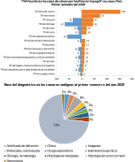
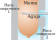
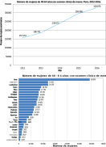

class: middle, center

```{r setup, include=FALSE}
options(htmltools.dir.version = FALSE)
library(kableExtra)
library(knitr)
library(kableExtra)
library(tidyverse)
library(RefManageR)
BibOptions(check.entries = FALSE,
           bib.style = "authoryear",
           cite.style = "authoryear",
           style = "markdown",
           hyperlink = FALSE,
           dashed = TRUE,
           bibpunct = list("(",")" ,"[" ,"]" ,";", ","),
           no.print.fields = "eprint") 
biblio <- ReadBib("biblio.bib", check = FALSE)
```

```{r xaringanExtra, echo=FALSE}
xaringanExtra::use_xaringan_extra(c("panelset"))
xaringanExtra::style_panelset_tabs(
  active_foreground = "#0051BA",
  hover_foreground = "#d22",
  font_family = "Roboto")
xaringanExtra::use_tile_view()
xaringanExtra::use_freezeframe()
xaringanExtra::use_scribble()
```

```{r logoMecatronica, echo=FALSE, out.width = '32%'}

```

---
class: inverse, center, middle 
# Introducción
---
```{r echo=FALSE}
dominique2018 = Citep(biblio,"Dominique2018")
ministerio2018cancer1 = Citep(biblio,"ministerio2018Cancer1")
ministerio2020Cancer1 = Citep(biblio,"ministerio2020Cancer1")
```
.pull-leftN[
# Realidad Problemática
## .purple3[De la paciente]
  * Elevadas tasas de incidencia, nuevos casos y mortalidad de cáncer de mama a nivel nacional.
  * Diagnóstico tardío del cáncer.
  * Disminuir la experiencia traumática del cribado (<b style="color :blue;">screnning</b>):
      + Minimizar el dolor por comprensión de la mama (Rx<sup>a</sup>).
      + Repeticiones innecesarias de biopsia.
      + Daño por dosis de radiación (Rx).]

???
La realidad problemática del presente estudio está basado en la situacion y condiciones actuales de los principales partícipes durante un diagnóstico de cáncer de mama en mujeres: Paciente y médico.

Entonces, desde la perspectiva de la paciente, se tiene que:
* Es preocupante que aún existan:: Elevadas tasas ..., aumento de nuevos casos, .. Y sobre todo que Mujeres son las principales afectadas ya que solo el 1% de varones sufren este cáncer.
* A ello, se suma la pobre eduación clínica y familiar sobre la autoexaminación y chequeos periódicas que llevan ..:: Diagnóstico ...
* Ya, durante la etapa de tratamiento, los testimonios recogidos coinciden que la experiencia no es la mejor ya que::
	* Existen dolor durante el diagnóstico por mamografía.
	* Complicado por el número de repeticiones ...
	* Y quizas, lo más controversial, la exposición a 		pequeñas dosis de Rx también por Mamografía.
--
.pull-rightN[
```{r realidadPaciente1, echo=FALSE, fig.cap=ministerio2020Cancer1, out.width = '83%', fig.align="center"}

```
]
.footnote[
[a] Radiografía
]

???
Así se tiene que, de los últimos reportes a nivel nacional sobre cáncer.

En esta primera gráfica, se apecaia que el cáncer de mama sigue siendo uno de los prinpales cánceres femeninos en conjunto con el de cuello uterino.

Y que de ellos, la principales base de diagnóstico es el uso de imágenes clínicas (US, Mamografía, Resonancia magnética y Tomografía). Lo que refleja su gran impacto y rol clínico.


---
```{r echo=FALSE}
Eviva2013 = Citep(biblio,"Eviva2013")
```
.pull-leftN[
# Realidad Problemática
## .purple3[De la paciente]
```{r realidadPaciente2, echo=FALSE, fig.cap=paste0("Adaptado de ",Eviva2013), out.width = '75%', fig.align="center"}

```
]

???
Continuando, se ejemplifica una de las causas de dolor en mujeres durante el diagnóstico mamográfico que involucra:
* Dos placas compresoras métalicas que reducen el espacio o ancho natural de la mama a un mínimo.
* Así mismo, desde la decada pasada existe una tendencia de aumento del número de casos diagnóstico por cáncer, lo que ha llevado que las principales regiones donde ocurren sean:

--
.pull-rightN[
```{r realidadPaciente3, echo=FALSE, fig.cap=ministerio2018cancer1, out.width = '75%', fig.align="center"}

```
]
???
* Así mismo, desde la decada pasada existe una tendencia de aumento del número de casos diagnóstico por cáncer, lo que ha llevado que las principales regiones donde ocurren sean:

---
```{r include=FALSE}
Dominique2018 = Citep(biblio,"Dominique2018")
Gao2020 = Citep(biblio,"Gao2020",.opts = list(longnamesfirst = FALSE, max.names=2))
Acuson2018 = Citep(biblio,"Acuson2018")
HologicBrochure = Citep(biblio,"HologicBrochure")
labelTecnologiaScreening = paste0("a) ",Dominique2018,". b) ",Gao2020, ". c) ",Acuson2018," . d-e)",HologicBrochure)
```
.pull-left[
# Realidad Problemática
## .blue[Del médico radiólogo]
  * Biopsia y diagnóstico por imagen más rápidos y precisos para detención y control de cáncer mamario.
  * Naturaleza .blue[operador-dependiente] de la biopsia percutánea guiada por US a mano alzada (HHUS).
      - Fatiga por localización anatómica de la zona de sospecha y ubicación precisa de agujas.
      - Baja reproducibilidad.
  * Disponibilidad y acceso a screenings más costosos pero eficaces:
      - Mamografía digital (Rx).
      - Imagen de Resonancia Magnética (MRI).
      - Tomografía Computarizada (TC).]
      
???
El segúndo partícipe de esta realidad problemática, es la del médico, específicamente la del médico radiólogo encargado de diagnósticar e intervenir en actividades a fines al cáncer.
* Lo que llevadado a la busqueda de nuevas tecnologías para su diagnóstico y control. Pero, que algunas de ellas depende de la experiencia y habilidad del médico (conocido como operador-dependencia). Tal es el caso de, 

* Por otro lado, existe una indisponibilidad de acceder siempre a tecnologías validamente más eficases pero costosas.
--
.pull-right[
```{r realidadMedico, echo=FALSE, fig.cap=labelTecnologiaScreening, out.width = '80%'}
knitr::include_graphics("image/tecnologiasScreening.svg")
```
]

---
# Formulación del Problema
.full-width[.content-box-blue[
.Large[*¿Cómo mejorar el guiado de agujas de manera precisa y autónoma en biopsia percutánea de
mama para el diagnóstico de cáncer en mujeres?*]
]]

???
Entonces, con base a lo anterior, es que se formuló el siguiente problema de investigación.

Que a su vez, derivó en intentar responder 3 preguntas de estudio. 

--
![:col_header Pregunta 1, Pregunta 2, Pregunta 3]
![:col_list 
¿Puede mejorarse el proceso actual de biopsias percutáneas de mama para beneficio de pacientes y médicos?, 

¿Puede automatizarse el diagnóstico por imagen y biopsia de mama para mejorar la detección temprana de cáncer?, 

¿Como mejorar la precisión de biopsas percutánas de mama mediante la inclusión tecnológica que aproveche las ventajas del diagnóstico por imagen?
]


???
Y para dar respuesta, es que se planteó la siguiente hipótesis

---
.left-column[
# Hipótesis
.full-width[.content-box-red[
Mediante el modelamiento y simulación de un robot clínico asistido por US 3D como sistema de guiado de inserción de agujas será posible mejorar la precisión de biopsia percutánea de mama.
]]
]

???
Como pueden notar, la ténica de US fue la escogida como base del estudio robótico porque? Por los siguiente motivos que justifican:
--
.right-column[
# Justificación
```{r justificacion, echo=FALSE, out.width = '88%'}

```
]

???
*Relevancia social: Al Intenta ofrecer una alternativa para diagnóstico de cáncer. Mediante la manipulación de herramientas y dispositivo médicos, 
* Tiene un gran impacto económico: Por que el US es la técnica más barata y por ende, ... hospitales de categoria media y alta.
* A nivel teórico tambien, porque aporta conocimiento en el campo de la robótica medica ...
Y porque puede abrir una nueva linea .... mecatrónica médica ...
* A nivel tech., porque pretende aprovechar el potencial robótico para mejorar técnicas convencionales.
* A nivel metodologíco, porque la hipotesis planteada funciona sobre la una simulación computacional que : ...
* Y finalmente, por su gran impacto en salud, al buscar mejorar y aliviar el procedimiento de biopsia tanto para médico y paciente en cáncer de mama.

---
# Objetivos
.left-column[.full-width[.content-box-yellow[
### Objetivo General
- Determinar el efecto del modelamiento y simulación de un robot clínico asistido por US<sup>a</sup> 3D
como sistema de guiado de agujas en biopsia percutánea de mama.
]]]

???
* Así, el objetivo principal a lo largo de todo el estudio fue:...

--
.right-column[.full-width[.content-box-green[
### Objetivos Específicos
- Identificar las funciones, espacio de trabajo y requerimientos que debe cumplir un robot clínico para biopsia percutánea de mama guiado por US 3D.
- Determinar la morfología del robot cumpliendo las exigencias de una biopsia percutánea guiada por US 3D.
- Determinar un modelo cinemático para el robot.
- Determinar un modelo dinámico pare el robot.
- Definir un modelo CAD<sup>b</sup> de la estructura física del robot.
- Generar trayectorias de inserción para agujas en biopsia percutánea de mama guiada robóticamente.
- Simular y verificar por computador el modelo propuesto para el robot clínico en un entorno virtual robótico.

]]]

.footnote[
[a] Ultrasonido, Ultrasonografía, Ultrasound.

[b] Dibujo Asistido por Computadora.
]

???
* Y para ello, se cumplió los siguiente objetivos específicos:

Primero, ...
Seguido por..
Además de ...
Obtener un ..
Para luego...
Y finalmente, ...

---
class: inverse, center, middle
# Materiales y Métodos

---
```{r child = 'materialesMetodos.Rmd'}
```
---
class: inverse, center, middle
# Resultados

---
<div class="my-footer"><span>&emsp;&emsp;&emsp;&emsp;&emsp;&emsp; Modelamiento y simulación de un robot clínico asistido por Ultrasonido 3D para mejorar el guiado de inserción de agujas en biopsia percutánea de mama</span></div> 

```{r child = 'resultados.Rmd'}
```

---
class: inverse, center, middle
#Conclusiones

---
<div class="my-footer"><span>&emsp;&emsp;&emsp;&emsp;&emsp;&emsp; Modelamiento y simulación de un robot clínico asistido por Ultrasonido 3D para mejorar el guiado de inserción de agujas en biopsia percutánea de mama</span></div>  

```{r child = 'conclusiones.Rmd'}
```

---
class: inverse, center, middle
#Recomendaciones

---
```{r child = 'recomendacion.Rmd'}
```

---
class: center, middle
# Muchas Gracias !!!

---
# Referencias
```{r refs1, echo=FALSE, results="asis"}
PrintBibliography(biblio, start = 1, end = 7)
```

---
# Referencias
```{r refs2, echo=FALSE, results="asis"}
PrintBibliography(biblio, start = 8, end = 14)
```

# Referencias
```{r refs3, echo=FALSE, results="asis"}
PrintBibliography(biblio, start = 15, end = 21)
```
---
class: title-slide-final, middle
# Gracias de nuevo !!!

Slides creados mediante el paquete de R [**xaringan**](https://github.com/yihui/xaringan).

Con ayuda de [remark.js](https://remarkjs.com), [**knitr**](https://yihui.org/knitr/), y [R Markdown](https://rmarkdown.rstudio.com).
