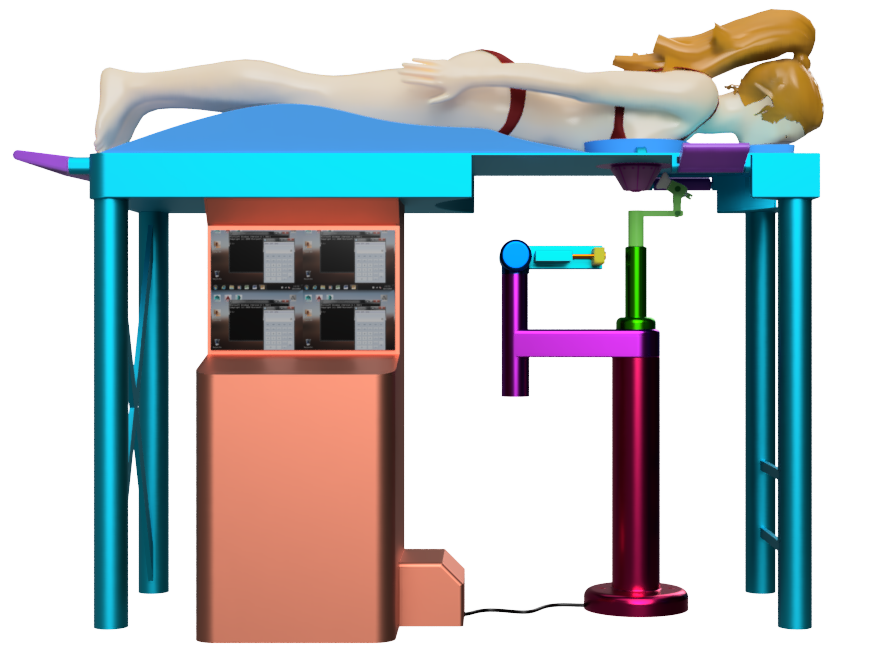

.pull-leftNN[
## Del Modelamiento: .orange[Dispositivo sujetador]
```{r resCopasSujetador, echo=FALSE, fig.cap="Dispositivos sujetadores de mama según tamaño de copa: A, B, C y D.", out.width = '95%'}

```
]

.pull-rightNN[
```{r resPartesSujetador, echo=FALSE, fig.cap ="Detalles del dispositivo sujetador",out.width = '95%', fig.align="center"}
knitr::include_graphics("image/partesSujetador.svg")
```
]

---
.pull-leftNN[
## Del Modelamiento. Robot clinico: .orange[Morfología]
```{r valoresInicialesAreaTrabajo, echo=FALSE,out.width = '86%'}

```
]

.pull-rightNN[
```{r dimensionesRobot, echo=FALSE,out.width = '100%'}
knitr::include_graphics("image/dimensionesRobot.svg")
```
]

---
.pull-left[
## Del Modelamiento: .orange[Cinemático]
$$\begin{equation}
	\begin{array}{*{5}{c}}
		{{S_1} = \left[ {\begin{array}{*{20}{c}}
					0 \\ 
					0 \\ 
					1 \\ 
					0 \\ 
					0 \\ 
					0 
			\end{array} } \right]}&{{S_2} = \left[ {\begin{array}{*{20}{c}}
					0 \\ 
					0 \\ 
					0 \\ 
					0 \\ 
					0 \\ 
					1 
			\end{array} } \right]}&{{S_3} = \left[ {\begin{array}{*{20}{c}}
					0 \\ 
					{ - 1} \\ 
					0 \\ 
					{876} \\ 
					0 \\ 
					{300} 
			\end{array}} \right]}\\
			{{S_4} = \left[ {\begin{array}{*{20}{c}}
					0 \\ 
					0 \\ 
					0 \\ 
					1 \\ 
					0 \\ 
					0 
			\end{array} } \right]}&{{S_5} = \left[ {\begin{array}{*{20}{c}}
					0 \\ 
					0 \\ 
					0 \\ 
					1 \\ 
					0 \\ 
					0 
			\end{array} } \right]} 
	\end{array}
\end{equation}$$

$$\begin{array}{*{20}{c}}
		{{M_1} = \left[ {\begin{array}{*{20}{c}}
					1&0&0&0 \\ 
					0&1&0&0 \\ 
					0&0&1&{666} \\ 
					0&0&0&1 
			\end{array}} \right]}&{{M_2} = \left[ {\begin{array}{*{20}{c}}
					1&0&0&{ - 300} \\ 
					0&1&0&0 \\ 
					0&0&1&{660} \\ 
					0&0&0&1 
			\end{array}} \right]}
	\end{array}$$
]

.pull-rightN[
$$\begin{equation}\begin{array}{*{20}{c}}
		{{M_3} = \left[ {\begin{array}{*{20}{c}}
					1&0&0&{ - 300} \\ 
					0&0&{ - 1}&0 \\ 
					0&1&0&{876} \\ 
					0&0&0&1 
			\end{array}} \right]}&
		{{M_4} = \left[ {\begin{array}{*{20}{c}}
					0&0&1&{ - 300} \\ 
					0&{ - 1}&0&{100} \\ 
					1&0&0&{876} \\ 
					0&0&0&1 
			\end{array}} \right]}\\
		{{M_5} = \left[ {\begin{array}{*{20}{c}}
					0&0&1&{ - 78} \\ 
					{ - 1}&0&0&0 \\ 
					0&{ - 1}&0&{876} \\ 
					0&0&0&1 
			\end{array}} \right]}&{{M_6} = \left[ {\begin{array}{*{20}{c}}
					0&0&1&{ - 83.5} \\ 
					{ - 1}&0&0&0 \\ 
					0&{ - 1}&0&{876.0} \\ 
					0&0&0&1 
			\end{array}} \right]} 
	\end{array}
\end{equation}$$

```{r espacioEfectorFinal, echo=FALSE,out.width = '85%', fig.align='right'}

```
]

---
## Del Modelamiento: .orange[Modelo CAD]
```{r partesRobot, echo=FALSE,out.width = '88%', fig.align='center'}
knitr::include_graphics("image/partesRobot.svg")
```

---
.pull-leftNN[
## Del Modelamiento: .orange[Dinámico]
$$\begin{equation}
	\begin{array}{*{20}{l}}
			{{M_{{l_1}}} = \left[ {\begin{array}{*{20}{c}}
						1&0&0&{ - 181.24} \\ 
						0&1&0&0 \\ 
						0&0&1&{653.20} \\ 
						0&0&0&1 
				\end{array}} \right]}\\
				{{M_{{l_2}}} = \left[ {\begin{array}{*{20}{c}}
						1&0&0&{ - 300.3} \\ 
						0&1&0&{ - 20.00} \\ 
						0&0&1&{816.70} \\ 
						0&0&0&1 
				\end{array}} \right]} & 
			{{M_{{l_3}}} = \left[ {\begin{array}{*{20}{c}}
						1&0&0&{ - 209.10} \\ 
						0&0&{ - 1}&{52.70} \\ 
						0&1&0&{877.00} \\ 
						0&0&0&1 
				\end{array}} \right]}\\
				{{M_{{l_4}}} = \left[ {\begin{array}{*{20}{c}}
						0&0&1&{ - 144.30} \\ 
						0&{ - 1}&0&{75.40} \\ 
						1&0&0&{874.60} \\ 
						0&0&0&1 
				\end{array}} \right]} & 
		{{M_{{l_5}}} = \left[ {\begin{array}{*{20}{c}}
					0&0&1&{ - 94.10} \\ 
					0&{ - 1}&0&{0.10} \\ 
					1&0&0&{876.00} \\ 
					0&0&0&1 
			\end{array}} \right]}\\
			{{M_{{l_1}{l_2}}} = \left[ {\begin{array}{*{20}{c}}
						1&0&0&{{\text{ - 119}}{\text{.03}}} \\ 
						0&1&0&{{\text{ - 20}}{\text{.04}}} \\ 
						0&0&1&{{\text{163}}{\text{.50}}} \\ 
						0&0&0&1 
				\end{array}} \right]}& 
			{{M_{{l_2}{l_3}}} = \left[ {\begin{array}{*{20}{c}}
						1&0&0&{{\text{91}}{\text{.19}}} \\ 
						0&0&{ - 1}&{{\text{72}}{\text{.78}}} \\ 
						0&1&0&{{\text{60}}{\text{.30}}} \\ 
						0&0&0&1 
				\end{array}} \right]}
	\end{array} 
\end{equation}$$

]

.pull-rightNN[
$$\begin{equation}
	\begin{array}{*{20}{c}}
		\begin{array}{*{20}{c}}
			{{M_{{l_3}{l_4}}} = \left[ {\begin{array}{*{20}{c}}
						0&0&1&{{\text{64}}{\text{.82}}} \\ 
						1&0&0&{{\text{ - 2}}{\text{.36}}} \\ 
						0&1&0&{{\text{ - 22}}{\text{.63}}} \\ 
						0&0&0&1 
				\end{array}} \right]}& 
			{{M_{{l_4}{l_5}}} = \left[ {\begin{array}{*{20}{c}}
						1&0&0&{{\text{1}}{\text{.40}}} \\ 
						0&1&0&{{\text{75}}{\text{.44}}} \\ 
						0&0&1&{{\text{50}}{\text{.20}}} \\ 
						0&0&0&1 
				\end{array}} \right]}
		\end{array}
		\\{{M_{{l_5}6}} = \left[ {\begin{array}{*{20}{c}}
					0&0&1&{ - 83.5} \\ 
					{ - 1}&0&0&0 \\ 
					0&{ - 1}&0&{876.0} \\ 
					0&0&0&1 
			\end{array}} \right]} 
	\end{array} 
\end{equation}$$

$$\begin{equation}
	\begin{array}{*{20}{r}}
		{{A_1} = \left[ {\begin{array}{*{20}{c}}
					0 \\ 
					0 \\ 
					1 \\ 
					0 \\ 
					{{\text{ - 181}}{\text{.24}}} \\ 
					0 
			\end{array}} \right]}&{{A_2} = \left[ {\begin{array}{*{20}{c}}
					0 \\ 
					0 \\ 
					0 \\ 
					0 \\ 
					0 \\ 
					1 
			\end{array} } \right]}\\{{A_3} = \left[ {\begin{array}{*{20}{c}}
					0 \\ 
					0 \\ 
					1 \\ 
					{{\text{ - 0}}{\text{.96}}} \\ 
					{{\text{90}}{\text{.92}}} \\ 
					0 
			\end{array}} \right]}&{{A_4} = \left[ {\begin{array}{*{20}{c}}
					0 \\ 
					0 \\ 
					0 \\ 
					0 \\ 
					0 \\ 
					1 
			\end{array} } \right]}&{{A_5} = \left[ {\begin{array}{*{20}{c}}
					0 \\ 
					0 \\ 
					0 \\ 
					0 \\ 
					0 \\ 
					1 
			\end{array} } \right]} 
	\end{array} 
\end{equation}$$

]

---
.pull-leftN3[
## Del Modelamiento: .orange[Dinámico]
```{r variablesInercia, echo=FALSE,out.width = '100%', fig.align='left'}

```
]

.pull-rightN3[
$$\begin{equation}
	\begin{array}{*{20}{c}}
		\begin{array}{*{20}{c}}
			{{I_{c1}} = \left[ {\begin{array}{*{20}{c}}
						{{\text{0}}{\text{.0265}}}&{{\text{0}}{\text{.0000}}}&{{\text{0}}{\text{.0000}}} \\ 
						{}&{{\text{0}}{\text{.0822}}}&{{\text{0}}{\text{.0000}}} \\ 
						{}&{}&{{\text{0}}{\text{.0990}}} 
				\end{array}} \right]}&{{I_{c2}} = \left[ {\begin{array}{*{20}{c}}
						{{\text{0}}{\text{.0025}}}&{{\text{0}}{\text{.0000}}}&{{\text{0}}{\text{.0000}}} \\ 
						{}&{{\text{0}}{\text{.0121}}}&{{\text{0}}{\text{.0000}}} \\ 
						{}&{}&{{\text{0}}{\text{.0127}}} 
				\end{array}} \right]} \\ 
			{{I_{c3}} = \left[ {\begin{array}{*{20}{c}}
						{{\text{0}}{\text{.0083}}}&{{\text{0}}{\text{.0000}}}&{{\text{0}}{\text{.0000}}} \\ 
						{}&{{\text{0}}{\text{.0106}}}&{{\text{0}}{\text{.0000}}} \\ 
						{}&{}&{{\text{0}}{\text{.0173}}} 
				\end{array}} \right]}&{{I_{c4}} = \left[ {\begin{array}{*{20}{c}}
						{{\text{0}}{\text{.0016}}}&{{\text{0}}{\text{.0000}}}&{{\text{0}}{\text{.0000}}} \\ 
						{}&{{\text{0}}{\text{.0020}}}&{{\text{0}}{\text{.0000}}} \\ 
						{}&{}&{{\text{0}}{\text{.0035}}} 
				\end{array}} \right]}
		\end{array}\\
		{{I_{c5}} = \left[ {\begin{array}{*{20}{c}}
					{{\text{0}}{\text{.0602}}}&{{\text{0}}{\text{.0000}}}&{{\text{0}}{\text{.0000}}} \\ 
					{}&{{\text{0}}{\text{.3642}}}&{{\text{0}}{\text{.0000}}} \\ 
					{}&{}&{{\text{0}}{\text{.3908}}} 
			\end{array}} \right] \cdot {{10}^{ - 3}}}{{\text{ kg}} \cdot {{\text{m}}^2}}\hfill
	\end{array} 
\end{equation}$$

$$\begin{equation}
	\begin{gathered}
		{G_1} = {\text{Matriz Diagonal (}}\left[ {\begin{array}{*{20}{c}}
				{{\text{0}}{\text{.0265}}}&{{\text{0}}{\text{.0822}}}&{{\text{0}}{\text{.0990}}}&{{\text{4}}{\text{.8170}}}&{{\text{4}}{\text{.8170}}}&{{\text{4}}{\text{.8170}}} 
		\end{array}} \right]{\text{)}} \hfill \\
		{G_2} = {\text{Matriz Diagonal (}}\left[ {\begin{array}{*{20}{c}}
				{{\text{0}}{\text{.0025}}}&{{\text{0}}{\text{.0121}}}&{{\text{0}}{\text{.0127}}}&{{\text{1}}{\text{.9328}}}&{{\text{1}}{\text{.9328}}}&{{\text{1}}{\text{.9328}}} 
		\end{array}} \right]{\text{)}} \hfill \\
		{G_3} = {\text{Matriz Diagonal (}}\left[ {\begin{array}{*{20}{c}}
				{{\text{0}}{\text{.0083}}}&{{\text{0}}{\text{.0106}}}&{{\text{0}}{\text{.0173}}}&{{\text{2}}{\text{.2453}}}&{{\text{2}}{\text{.2453}}}&{{\text{2}}{\text{.2453}}} 
		\end{array}} \right]{\text{)}} \hfill \\
		{G_4} = {\text{Matriz Diagonal (}}\left[ {\begin{array}{*{20}{c}}
				{{\text{0}}{\text{.0016}}}&{{\text{0}}{\text{.0020}}}&{{\text{0}}{\text{.0035}}}&{{\text{0}}{\text{.7774}}}&{{\text{0}}{\text{.7774}}}&{{\text{0}}{\text{.7774}}} 
		\end{array}} \right]{\text{)}} \hfill \\
		{G_5} = {\text{Matriz Diagonal (}}\left[ {\begin{array}{*{20}{c}}
				{{\text{0}}{\text{.0001}}}&{{\text{0}}{\text{.0004}}}&{{\text{0}}{\text{.0004}}}&{{\text{0}}{\text{.2970}}}&{{\text{0}}{\text{.2970}}}&{{\text{0}}{\text{.2970}}} 
		\end{array}} \right]{\text{)}} \hfill \\ 
	\end{gathered} 
\end{equation}$$

.full-width[.content-box-yellow[Usando las variables anteriores, la dinámica inversa mediante el **Algoritmo 4: Método Newton-Euler** resultó definido.]]
.full-width[.content-box-blue[De igual modo, el modelo de dinámica directa se resolvió mediante las soluciones parciales $M, C , N, h, J*F$ en la ecuación dinámica.]]

]
---
## Del Modelamiento: .orange[Dinámico]
.center[
$$\begin{equation}
  \begin{array}{*{20}{c}}
		M(\theta) = \left( {\begin{array}{*{20}{c}}
				{{\sigma _1}}&0&{{\sigma _2}}&{{\sigma _4}}&{{\sigma _7}}\\
				0&{{m_2} + {m_3} + {m_4} + {m_5}}&{{\sigma _3}}&{{\sigma _5}}&{{m_5}\sin ({\theta_3})}\\
				{{\sigma _2}}&{{\sigma _3}}&{{\sigma _8}}&{{\sigma _6}}&{ - {\rm{c5x}}{\kern 1pt} {\kern 1pt} {m_5}}\\
				{{\sigma _4}}&{{\sigma _5}}&{{\sigma _6}}&{{m_4} + {m_5}}&{{m_5}}\\
				{{\sigma _7}}&{{m_5}\sin ({\theta_3})}&{ - {\rm{c5x}}{\kern 1pt} {\kern 1pt} {m_5}}&{{m_5}}&{{m_5}}
		\end{array}} \right)\\
		C(\theta,\dot{\theta}) = \left( {\begin{array}{*{20}{c}}
				{{\sigma _7}}&0&{{\sigma _{9}}}&{ - \frac{{\dot \theta_1}{\kern 1pt}}{2}{\sigma _5} - {\dot{\theta}_3}{\kern 1pt} {\rm{sin}}\left( {{\theta_3}} \right){\kern 1pt} {\sigma _3}}&{{\sigma _6} - {\rm{c5y}}{\kern 1pt} {\dot{\theta}_3}{\kern 1pt} {m_5}{\kern 1pt} {\rm{sin}}\left( {{\theta_3}} \right)}\\
				0&0&{{\sigma _{10}}}&{{\dot{\theta}_3}{\kern 1pt} {\rm{cos}}\left( {{\theta_3}} \right){\kern 1pt} \left( {{m_4} + {m_5}} \right)}&{{\dot{\theta}_3}{\kern 1pt} {m_5}{\kern 1pt} {\rm{cos}}\left( {{\theta_3}} \right)}\\
				{ - \frac{{\dot{\theta}_1}{\kern 1pt}}{2}{\sigma _4}}&0&{{\sigma _{11}}}&{{\sigma _2}}&{{\dot{\theta}_3}{\kern 1pt} {m_5}{\kern 1pt} \left( {{L_3} + {\rm{c5z}} + {\theta_4} + {\theta_5}} \right)}\\
				{{\sigma _{8}}}&0&{ - {\sigma _2}}&0&0\\
				{ - {\sigma _6}}&0&{ - \frac{{\dot{\theta}_3}{\kern 1pt}}{2}{m_5}{\kern 1pt} {\sigma _1}}&0&0
		\end{array}} \right)\\
		N(\theta) = \left( {\begin{array}{*{20}{c}}
				0\\
				{ - g{\kern 1pt} \left( {{m_2} + {m_3} + {m_4} + {m_5}} \right)}\\
				{ - {\rm{g}}\left( {{\kern 1pt} {\kern 1pt} {\rm{cos}}\left( {{\theta_3}} \right)\left( {{m_4}\left( {{\rm{c4z}} + {\theta_4}} \right) + {m_5}{\kern 1pt} \left( {{L_3} + {\rm{c5z}} + {\theta_4} + {\theta_5}} \right) + {\rm{c3x}}{\kern 1pt} {\kern 1pt} {m_3}} \right) - \sigma_1} \right)}\\
				{ - g{\kern 1pt} {\rm{sin}}\left( {{\theta_3}} \right){\kern 1pt} \left( {{m_4} + {m_5}} \right)}\\
				{ - g{\kern 1pt} {m_5}{\kern 1pt} {\rm{sin}}\left( {{\theta_3}} \right)}
		\end{array}} \right)
	\end{array}
	\end{equation}$$
]


---
.pull-leftNN[
## Del Modelamiento.Generación de trayectorias: .orange[Del robot]
Utilizando la función **getPathtPlanner**.
```{r pathPlannerRobot, echo=FALSE,out.width = '100%', fig.align='left'}

```
]

.pull-rightNN[
.content-box-blue[Trayectorias mediante la interpolación polinómica:]
* Polinomios de tercer orden.
* Polinomios de quinto orden.
```{r interpolacionRobot, echo=FALSE,out.width = '100%', fig.align='left'}

```
]

---
.pull-leftNN[
## Del Modelamiento.Generación de trayectorias: .orange[De la inserción]
```{r interpolacionEE, echo=FALSE,out.width = '95%', fig.align='left'}

```
]

.pull-rightNN[
**Poner Animación**
**Poner Nuevo diagrama de flujo reducido simplificado**
]

---
.pull-leftNN[
## Del Modelamiento: .orange[Del Área de trabajo]
```{r dimensionAreaTrabajo, echo=FALSE,out.width = '85%', fig.align='left'}
knitr::include_graphics("tablas/tab_dimensionesAreaTrabajo.svg")
```
]

.pull-rightNN[
```{r espacioTrabajo, echo=FALSE,out.width = '74%', fig.align='center'}

```
```{r sistemaABUS, echo=FALSE,out.width = '78%', fig.align='center'}

```
]
---
## Del Modelamiento: .orange[Del Área de trabajo]
```{r include=FALSE}
Assuredrad2020 = Citet(biblio,"Assuredrad2020",.opts = list(longnamesfirst = FALSE, max.names=1))
HologicWeb1 = Citet(biblio,"HologicWeb1",.opts = list(longnamesfirst = FALSE, max.names=1))
```

```{r comparativaDimensionesArea, echo=FALSE,out.width = '100%', fig.align='center'}

```

---
## De la simulación. .orange[De la GUI]
.panelset[
.panel[.panel-name[Obtener objetivo de biopsia]
```{r GUI_tab1, echo=FALSE,out.width = '70%', fig.align='center'}
knitr::include_graphics("image/GUI_mainRUN.png")
```
]

.panel[.panel-name[Definición de inserción]
```{r GUI_tab11, echo=FALSE,out.width = '70%', fig.align='center'}
knitr::include_graphics("image/GUI_mainInsertionAngleRUN.png")
```
]

.panel[.panel-name[Preposicionamiento]
```{r GUI_tab2, echo=FALSE,out.width = '70%', fig.align='center'}

```
]

.panel[.panel-name[Posposicionamiento]
```{r GUI_tab3, echo=FALSE,out.width = '70%', fig.align='center'}
knitr::include_graphics("image/biopsyRobotResult.png")
```
]
]
---
.panelset[
.panel[.panel-name[Verificar colisiones tipo 1 y 2]
```{r GUI_colisiones, echo=FALSE,out.width = '100%', fig.align='center'}

```
]

.panel[.panel-name[Verificar colsiones tipo 4]
```{r GUI_colisions2, echo=FALSE,out.width = '100%', fig.align='center'}

```
> * La **profundidad del objetivo** y el **tipo de aguja** (sobre todo CN) condicionan un posible daño en la pared torácica (riesgo de neumotórax).
> * Su conocimiento y manipulación a priori influyen positivamente en el criterio medico.

]

.panel[.panel-name[Robot set-up]
```{r GUI_robotSetup, echo=FALSE,out.width = '100%', fig.align='center'}

```
]
]

---
## De la simulación.Del entorno robótico:.orange[Modelos de simulación]
```{r GUI_modeloSimulacion, echo=FALSE,out.width = '75%', fig.align='center'}

```
---
## De la simulación.
### Del entorno robótico: .orange[Procedimiento de biopsia]
.pull-leftN3[
.full-width[.content-box-yellow[
Según flujo de trabajo clínico:
1. **Preparación del paciente**
2. **Localización de la lesión**
3. **Selección del objetivo**
4. **Preparación de biopsia**
5. Preparación de zona de inserción
6. Posicionamiento del robot
7. Ejecución de biopsia
8. Preparativos de finalización
]]
]

.pull-rightN3[
```{r GUI_simPaso1_4, echo=FALSE,out.width = '100%', fig.align='center'}

```
]
---
## De la simulación.
### Del entorno robótico: .orange[Procedimiento de biopsia]
.pull-leftN3[
.full-width[.content-box-yellow[
Según flujo de trabajo clínico:
1. Preparación del paciente
2. Localización de la lesión
3. Selección del objetivo
4. Preparación de biopsia
5. **Preparación de zona de inserción**
6. **Posicionamiento del robot**
7. Ejecución de biopsia
8. Preparativos de finalización
]]
]

.pull-rightN3[
```{r GUI_simPaso5_6, echo=FALSE,out.width = '100%', fig.align='center'}

```
]

---
## De la simulación.
### Del entorno robótico: .orange[Procedimiento de biopsia]
.pull-leftN3[
.full-width[.content-box-yellow[
Según flujo de trabajo clínico:
1. Preparación del paciente
2. Localización de la lesión
3. Selección del objetivo
4. Preparación de biopsia
5. Preparación de zona de inserción
6. Posicionamiento del robot
7. **Ejecución de biopsia**
8. Preparativos de finalización
]]
]

.pull-rightN3[
```{r GUI_simPaso7, echo=FALSE,out.width = '100%', fig.align='center'}

```
]

---
## De la simulación:.orange[Resultados de simulación múltiple]
.panelset[
.panel[.panel-name[Experimento aleatorio]
```{r simTab1, echo=FALSE,out.width = '100%', fig.align='center'}

```
]
.panel[.panel-name[Para posiciones]
```{r simTab2, echo=FALSE,out.width = '100%', fig.align='center'}

```
]
.panel[.panel-name[Para orientaciones]
```{r simTab3, echo=FALSE,out.width = '100%', fig.align='center'}

```
]
]
